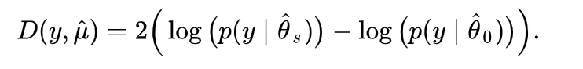

Práctica 11. Modelos generalizados: La regresión logística
================
AE
09/02/2019

-   [Previo: base de trabajo](#previo-base-de-trabajo)
-   [Regresión Logística](#regresión-logística)
    -   [Un solo predictor](#un-solo-predictor)
    -   [Predicción de probabilidades](#predicción-de-probabilidades)
    -   [Coeficientes exponenciados](#coeficientes-exponenciados)
    -   [Agregando una variable](#agregando-una-variable)
    -   [Bondad de Ajuste](#bondad-de-ajuste)
        -   [Devianza](#devianza)
        -   [Prueba de Verosimilitud](#prueba-de-verosimilitud)
        -   [Test Hosmer-Lemeshow Goodness of Fit "GOF"](#test-hosmer-lemeshow-goodness-of-fit-gof)
    -   [Tabla de modelos estimados](#tabla-de-modelos-estimados)

En esta práctica vamos a revisar los elementos básicos para la regresión logística. El proceso en R para todos los modelos generalizados se parece mucho. Por tanto, no será difícil que luego puedas utilizar otras funciones de enlace

Previo: base de trabajo
=======================

¡Recuerda, poner el directorio!

``` r
setwd("/Users/anaescoto/Dropbox/SFP")
```

Vamos a trabajar con la ENVIPE, tal como lo hicimos en la <a href="https://rpubs.com/aniuxa/SFP10">práctica 10</a> y en la <a href="https://rpubs.com/aniuxa/SFP10">práctica 9</a>.

Cargamos el ambiente (puedes descargarlo de <a href="https://www.dropbox.com/s/hfppwlr2h8qe4po/EnvironmentP9.RData?dl=0">aquí</a>)

``` r
load("EnvironmentP9.RData")
```

Vamos a hacer una sub-base de nuestras posibles variables explicativas. Esto es importante porque sólo podemos comparar modelos con la misma cantidad de observaciones. Incluimos hoy la variable "seguridad\_", que será nuestra variable dependiente puesto que queremos modelar una respuesta dicotómica. Omitimos el índice como explicativa, porque hay una obvia endogeneidad.

``` r
mydata<- TPer_Vic1_Hog[ ,c("gasto_seg_pc", "log_gasto_seg_pc"
                           ,"ESTRATO","EDAD", "SEXO", 
                           "seguridad_"
                           )]
```

Vamos a volver dicotómica nuestra variable y a omitir los NA

``` r
mydata$y_binomial[mydata$seguridad_=="No Aplica"]<-NA
mydata$y_binomial[mydata$seguridad_=="Seguro"]<-1
mydata$y_binomial[mydata$seguridad_=="Inseguro"]<-0


newdata <- na.omit(mydata)
```

\[Ojo lo hacemos con fines ilustrativos, hemos perdido muchas observaciones de nuestra variable dependiente por una independiente del gasto\]

Regresión Logística
===================

Un solo predictor
-----------------

``` r
modelo0<-glm(y_binomial ~ EDAD, family = binomial("logit"), data=newdata, na.action=na.exclude)
summary(modelo0)
```


    Call:
    glm(formula = y_binomial ~ EDAD, family = binomial("logit"), 
        data = newdata, na.action = na.exclude)

    Deviance Residuals: 
        Min       1Q   Median       3Q      Max  
    -1.6277  -1.3990   0.8327   0.9141   1.2485  

    Coefficients:
                 Estimate Std. Error z value Pr(>|z|)    
    (Intercept)  1.284758   0.033627   38.21   <2e-16 ***
    EDAD        -0.014953   0.000764  -19.57   <2e-16 ***
    ---
    Signif. codes:  0 '***' 0.001 '**' 0.01 '*' 0.05 '.' 0.1 ' ' 1

    (Dispersion parameter for binomial family taken to be 1)

        Null deviance: 44330  on 34652  degrees of freedom
    Residual deviance: 43946  on 34651  degrees of freedom
    AIC: 43950

    Number of Fisher Scoring iterations: 4

``` r
confint(modelo0)
```

    Waiting for profiling to be done...

                      2.5 %      97.5 %
    (Intercept)  1.21893838  1.35075629
    EDAD        -0.01645066 -0.01345564

Predicción de probabilidades
----------------------------

Para predecir la probabilidad, primero chequemos el rango de nuestra variabe explicativa

``` r
range(newdata$EDAD)
```

    [1] 18 97

Hacemos un vector con los valores que queremos predecir

``` r
xedad <- 18:97
```

Vamos a utilizar el comando "predict" para predecir los valores. Podemos el argumento "response" para que nos dé el logito

``` r
y_logito <- predict(modelo0, list(EDAD = xedad))
y_prob<- predict(modelo0, list(EDAD = xedad), type= "response")

results_m0<-cbind(y_logito, y_prob, xedad)
results_m0<-as.data.frame(results_m0)
```

Hoy podemos graficar

``` r
library(ggplot2)
ggplot(data=results_m0, aes(x=xedad, y=y_prob)) +
  geom_point()
```


Coeficientes exponenciados
--------------------------

Para interpretar mejor los coeficientes suelen exponenciarse y hablar de las veces que aumentan o disminuyen los momios con respecto a la unidad como base

``` r
exp(coef(modelo0))
```

    (Intercept)        EDAD 
      3.6137932   0.9851587 

Agregando una variable
----------------------

``` r
modelo1<-glm(y_binomial ~ EDAD + ESTRATO, family = binomial("logit"), data=newdata, na.action=na.exclude)
summary(modelo1)
```


    Call:
    glm(formula = y_binomial ~ EDAD + ESTRATO, family = binomial("logit"), 
        data = newdata, na.action = na.exclude)

    Deviance Residuals: 
        Min       1Q   Median       3Q      Max  
    -1.7917  -1.3779   0.8242   0.9202   1.3413  

    Coefficients:
                Estimate Std. Error z value Pr(>|z|)    
    (Intercept)  1.37297    0.04430  30.994  < 2e-16 ***
    EDAD        -0.01590    0.00077 -20.653  < 2e-16 ***
    ESTRATO2    -0.20785    0.03496  -5.946 2.75e-09 ***
    ESTRATO3     0.12069    0.03943   3.061  0.00221 ** 
    ESTRATO4     0.29422    0.04786   6.147 7.89e-10 ***
    ---
    Signif. codes:  0 '***' 0.001 '**' 0.01 '*' 0.05 '.' 0.1 ' ' 1

    (Dispersion parameter for binomial family taken to be 1)

        Null deviance: 44330  on 34652  degrees of freedom
    Residual deviance: 43698  on 34648  degrees of freedom
    AIC: 43708

    Number of Fisher Scoring iterations: 4

``` r
confint(modelo1)
```

    Waiting for profiling to be done...

                      2.5 %      97.5 %
    (Intercept)  1.28633695  1.45999054
    EDAD        -0.01741324 -0.01439472
    ESTRATO2    -0.27653057 -0.13949657
    ESTRATO3     0.04332318  0.19790687
    ESTRATO4     0.20053130  0.38816238

Este modelo tiene coeficientes que deben leerse "condicionados". Es decir, en este caso tenemos que el coeficiente asociado a la edad, mantiene constante el valor del estrato y viceversa.

Bondad de Ajuste
----------------

### Devianza

La devianza es una medida de la bondad de ajuste de los modelos lineales generalizados. O más bien, es una medida de la no-bondad del ajust, puesto que valores más altos indican un peor ajuste.

R nos da medidas de devianza: la devianza nula y la desviación residual. La devianza nula muestra qué tan bien la variable de respuesta se predice mediante un modelo que incluye solo la intersección (gran media).

### Prueba de Verosimilitud



¿Cómo saber si ha mejorado nuestro modelo? Podemos hacer un test que compare las devianzas(tendría la misma lógica que nuestra prueba F del modelo lineal). Para esto tenemos que instalar un paquete "lmtest"

``` r
#install.packages("lmtest", repos = "http://cran.us.r-project.org", dependencies = TRUE)
library(lmtest)
```

    Loading required package: zoo


    Attaching package: 'zoo'

    The following objects are masked from 'package:base':

        as.Date, as.Date.numeric

``` r
lrtest0<-lrtest(modelo0, modelo1)
lrtest0
```

    Likelihood ratio test

    Model 1: y_binomial ~ EDAD
    Model 2: y_binomial ~ EDAD + ESTRATO
      #Df LogLik Df  Chisq Pr(>Chisq)    
    1   2 -21973                         
    2   5 -21849  3 248.08  < 2.2e-16 ***
    ---
    Signif. codes:  0 '***' 0.001 '**' 0.01 '*' 0.05 '.' 0.1 ' ' 1

Como puedes ver, el resultado muestra un valor p muy pequeño (&lt;.001). Esto significa que agregar el estrato al modelo lleva a un ajuste significativamente mejor sobre el modelo original.

Podemos seguir añadiendo variables sólo "sumando" en la función

``` r
modelo2<-glm(y_binomial ~ EDAD + ESTRATO + SEXO, family = binomial("logit"), data=newdata, na.action=na.exclude)
summary(modelo2)
```


    Call:
    glm(formula = y_binomial ~ EDAD + ESTRATO + SEXO, family = binomial("logit"), 
        data = newdata, na.action = na.exclude)

    Deviance Residuals: 
        Min       1Q   Median       3Q      Max  
    -1.8613  -1.3640   0.8070   0.9229   1.3959  

    Coefficients:
                 Estimate Std. Error z value Pr(>|z|)    
    (Intercept)  1.523111   0.046189  32.976  < 2e-16 ***
    EDAD        -0.016018   0.000772 -20.748  < 2e-16 ***
    ESTRATO2    -0.204496   0.035021  -5.839 5.25e-09 ***
    ESTRATO3     0.129495   0.039520   3.277  0.00105 ** 
    ESTRATO4     0.302746   0.047965   6.312 2.76e-10 ***
    SEXOMujer   -0.281231   0.023078 -12.186  < 2e-16 ***
    ---
    Signif. codes:  0 '***' 0.001 '**' 0.01 '*' 0.05 '.' 0.1 ' ' 1

    (Dispersion parameter for binomial family taken to be 1)

        Null deviance: 44330  on 34652  degrees of freedom
    Residual deviance: 43549  on 34647  degrees of freedom
    AIC: 43561

    Number of Fisher Scoring iterations: 4

``` r
confint(modelo2)
```

    Waiting for profiling to be done...

                      2.5 %      97.5 %
    (Intercept)  1.43278499  1.61384795
    EDAD        -0.01753168 -0.01450539
    ESTRATO2    -0.27330414 -0.13601561
    ESTRATO3     0.05195470  0.20687895
    ESTRATO4     0.20885850  0.39688917
    SEXOMujer   -0.32648558 -0.23601960

Y podemos ver si introducir esta variable afectó al ajuste global del modelo

``` r
lrtest1<-lrtest(modelo1, modelo2)
lrtest1
```

    Likelihood ratio test

    Model 1: y_binomial ~ EDAD + ESTRATO
    Model 2: y_binomial ~ EDAD + ESTRATO + SEXO
      #Df LogLik Df  Chisq Pr(>Chisq)    
    1   5 -21849                         
    2   6 -21774  1 149.21  < 2.2e-16 ***
    ---
    Signif. codes:  0 '***' 0.001 '**' 0.01 '*' 0.05 '.' 0.1 ' ' 1

### Test Hosmer-Lemeshow Goodness of Fit "GOF"

El teste Homer-Lemeshow se calcula sobre los datos una vez que las observaciones se han segmentado en grupos basados en probabilidades predichas similares. Este teste examina si las proporciones observadas de eventos son similares a las probabilidades predichas de ocurrencia en subgrupos del conjunto de datos, y lo hace con una prueba de chi cuadrado de Pearson.

¡Ojo! No queremos rechazar la hipótesis nula. LoLa hipótesis nula sostiene que el modelo se ajusta a los datos y en el siguiente ejemplo rechazamos H0.

``` r
#install.packages("ResourceSelection", repos = "http://cran.us.r-project.org", dependencies = TRUE)
library(ResourceSelection)
```

    Warning: package 'ResourceSelection' was built under R version 3.5.2

    ResourceSelection 0.3-4      2019-01-08

``` r
hoslem.test(newdata$seguridad_, fitted(modelo2))
```

    Warning in Ops.factor(1, y): '-' not meaningful for factors


        Hosmer and Lemeshow goodness of fit (GOF) test

    data:  newdata$seguridad_, fitted(modelo2)
    X-squared = 34653, df = 8, p-value < 2.2e-16

No obstante, esta prueba ha sido criticada. Checa la postura de Paul Allison <https://statisticalhorizons.com/hosmer-lemesho> Es un problema que tenemos en muestras grandes. Casi siempre preferimos el enfoque de la devianza.

Tabla de modelos estimados
--------------------------

Recuerda que esta librería la instalamos en la práctica pasada

``` r
#install.packages("memisc", repos = "http://cran.us.r-project.org", 
     #                     dependencies = TRUE)
```

``` r
#install.packages("stargazer", 
#                 repos = #"http://cran.us.r-project.org", 
#                         dependencies = TRUE)
library(stargazer)
```

``` r
#stargazer(modelo0, modelo1,modelo2, type = 'latex', header=FALSE)
```

``` r
stargazer(modelo0, modelo1,modelo2, 
          type = 'text', header=FALSE)
```


    =====================================================
                              Dependent variable:        
                      -----------------------------------
                                  y_binomial             
                          (1)         (2)         (3)    
    -----------------------------------------------------
    EDAD               -0.015***   -0.016***   -0.016*** 
                        (0.001)     (0.001)     (0.001)  
                                                         
    ESTRATO2                       -0.208***   -0.204*** 
                                    (0.035)     (0.035)  
                                                         
    ESTRATO3                       0.121***    0.129***  
                                    (0.039)     (0.040)  
                                                         
    ESTRATO4                       0.294***    0.303***  
                                    (0.048)     (0.048)  
                                                         
    SEXOMujer                                  -0.281*** 
                                                (0.023)  
                                                         
    Constant           1.285***    1.373***    1.523***  
                        (0.034)     (0.044)     (0.046)  
                                                         
    -----------------------------------------------------
    Observations        34,653      34,653      34,653   
    Log Likelihood    -21,973.130 -21,849.090 -21,774.480
    Akaike Inf. Crit. 43,950.250  43,708.180  43,560.970 
    =====================================================
    Note:                     *p<0.1; **p<0.05; ***p<0.01

Para sacar los coeficientes exponenciados

``` r
stargazer(modelo0, modelo1,modelo2, 
          type = 'text', header=FALSE,
          apply.coef = exp,
          apply.se   = exp)
```


    =====================================================
                              Dependent variable:        
                      -----------------------------------
                                  y_binomial             
                          (1)         (2)         (3)    
    -----------------------------------------------------
    EDAD                 0.985       0.984       0.984   
                        (1.001)     (1.001)     (1.001)  
                                                         
    ESTRATO2                         0.812       0.815   
                                    (1.036)     (1.036)  
                                                         
    ESTRATO3                         1.128       1.138   
                                    (1.040)     (1.040)  
                                                         
    ESTRATO4                         1.342       1.354   
                                    (1.049)     (1.049)  
                                                         
    SEXOMujer                                    0.755   
                                                (1.023)  
                                                         
    Constant           3.614***    3.947***    4.586***  
                        (1.034)     (1.045)     (1.047)  
                                                         
    -----------------------------------------------------
    Observations        34,653      34,653      34,653   
    Log Likelihood    -21,973.130 -21,849.090 -21,774.480
    Akaike Inf. Crit. 43,950.250  43,708.180  43,560.970 
    =====================================================
    Note:                     *p<0.1; **p<0.05; ***p<0.01

También la librería "sjPlot" tiene el comando "plot\_model()" (instala el comando si no lo tienes)

``` r
library(sjPlot)
plot_model(modelo1)
```


Por default nos da los coeficientes exponenciados.

``` r
plot_model(modelo1, type="eff")
```

    $EDAD


    $ESTRATO


¿Cómo saber lo que tiene esos gráficos? Es bueno guardar siempre estos resultados en un objeto. Este objeto es una lista de dos listas

``` r
get<-plot_model(modelo1, type="eff")
get$EDAD
```


``` r
get$EDAD$data
```


    # Predicted probabilities of y_binomial 
    # x = EDAD 

       x predicted std.error conf.low conf.high
      10     0.763     0.027    0.753     0.772
      20     0.733     0.020    0.725     0.741
      30     0.701     0.014    0.695     0.707
      40     0.667     0.012    0.661     0.672
      60     0.593     0.018    0.584     0.601
      70     0.554     0.025    0.542     0.566
      80     0.514     0.032    0.499     0.530
     100     0.435     0.047    0.413     0.457

    Standard errors are on link-scale (untransformed).

``` r
get$ESTRATO
```


``` r
get$ESTRATO$data
```


    # Predicted probabilities of y_binomial 
    # x = ESTRATO 

     x predicted std.error conf.low conf.high
     1     0.675     0.031    0.661     0.688
     2     0.628     0.016    0.620     0.635
     3     0.701     0.024    0.691     0.710
     4     0.736     0.036    0.722     0.749

    Standard errors are on link-scale (untransformed).

``` r
stargazer(get$EDAD$data,
          type = 'text', header=FALSE)
```


    ==========================================================
    Statistic N   Mean  St. Dev.  Min  Pctl(25) Pctl(75)  Max 
    ----------------------------------------------------------
    x         10 55.000  30.277   10     32.5     77.5    100 
    predicted 10 0.606   0.112   0.435  0.524    0.692   0.763
    std.error 10 0.025   0.012   0.012  0.015    0.031   0.047
    conf.low  10 0.595   0.117   0.413  0.509    0.687   0.753
    conf.high 10 0.618   0.107   0.457  0.539    0.698   0.772
    ----------------------------------------------------------
