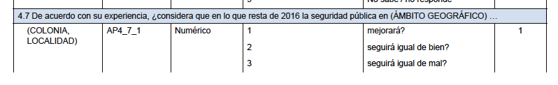

Práctica 9. ANOVA + Regresión lineal
================
Ana Escoto
25/01/2019

Previo: base de trabajo
=======================

¡Recuerda, poner el directorio!

``` r
setwd("/Users/anaescoto/Dropbox/SFP")
```

Vamos a trabajar con la ENVIPE. Con nuestro paquete foreign

``` r
#install.packages("foreign", repos = "http://cran.us.r-project.org", dependencies = TRUE)
library(foreign)
```

Llamamos nuestra base

``` r
TPer_Vic1 <- read.dbf("TPer_Vic1_mod.dbf")
```

### Merge

Revisa <a href="https://rpubs.com/aniuxa/SFP8">la práctica 8</a>. Para ajustar nuestro modelo necesitamos el dato de total de personas que está en la base de hogares

``` r
THogar <- read.dbf("THogar.dbf")
TPer_Vic1_Hog<-merge(THogar, TPer_Vic1, by=c("ID_VIV","HOGAR"))
dim(TPer_Vic1_Hog)
```

    ## [1] 91541   204

ANOVA
-----

Análisis de varianza. Haremos la versión más simple. Para ver el efecto de un factor sobre una variable cualitativa (oneway). Recordemos que los ingresos per capita son diferentes entre los hogares. Usamos per cápita porque los hogares de distintas estructuras tienen tamaños diferentes

``` r
TPer_Vic1_Hog$tot_int<-as.numeric(paste(TPer_Vic1_Hog$TOT_PER))
TPer_Vic1_Hog$gasto_seg_pc<-TPer_Vic1_Hog$gasto_seg/TPer_Vic1_Hog$tot_int
```

Supongamos que queremos ver si hay algún efecto de la percepción de la seguridad local en el gasto por seguridad

 El 4 es "empeorará"; 9 "No sabe o no responde"

``` r
table(TPer_Vic1_Hog$AP4_7_1)
```

    ## 
    ##     1     2     3     4     9 
    ## 19365 17401 28752 23633  2390

``` r
TPer_Vic1_Hog$perspectiva_local<-TPer_Vic1_Hog$AP4_7_1
TPer_Vic1_Hog$perspectiva_local[TPer_Vic1_Hog$AP4_7_1==9]<-NA

TPer_Vic1_Hog$perspectiva_local<-factor(TPer_Vic1_Hog$perspectiva_local,
                                        label=c("Mejora", "Igual - bien",
                                                "Igual - mal", "Empeora"))
```

\[Y recuerda que no tienes que instalar el paquete si ya lo instalaste\]

``` r
#install.packages("ggplot2", repos = "http://cran.us.r-project.org", 
# dependencies = TRUE)
library(ggplot2)
```

Hoy graficamos

``` r
q <- qplot(log(gasto_seg_pc+1),
           data=TPer_Vic1_Hog[TPer_Vic1_Hog$perspectiva_local!="NA",],
           geom="density", fill=factor(perspectiva_local), alpha=I(.5),
           main="Distribución de los ingresos corrientes", xlab="Logaritmo",
           ylab="Density")
q
```

    ## Warning: Removed 57277 rows containing non-finite values (stat_density).


La prueba ANOVA o análisis de varianza, nos dice cuánto de nuestra variable se ve explicado por un factor

``` r
anova <- aov(gasto_seg_pc ~ perspectiva_local, data=TPer_Vic1_Hog)
summary(anova)
```

    ##                      Df    Sum Sq  Mean Sq F value   Pr(>F)    
    ## perspectiva_local     3 2.598e+09 8.66e+08   15.11 7.96e-10 ***
    ## Residuals         34260 1.963e+12 5.73e+07                     
    ## ---
    ## Signif. codes:  0 '***' 0.001 '**' 0.01 '*' 0.05 '.' 0.1 ' ' 1
    ## 57277 observations deleted due to missingness

Comparación entre grupos
------------------------

¿si es significativo cuáles diferencias entre los grupos lo son?

``` r
TukeyHSD(anova)
```

    ##   Tukey multiple comparisons of means
    ##     95% family-wise confidence level
    ## 
    ## Fit: aov(formula = gasto_seg_pc ~ perspectiva_local, data = TPer_Vic1_Hog)
    ## 
    ## $perspectiva_local
    ##                               diff        lwr       upr     p adj
    ## Igual - bien-Mejora      -111.0410 -490.57190  268.4898 0.8760038
    ## Igual - mal-Mejora        410.2514  116.72579  703.7770 0.0018729
    ## Empeora-Mejora            625.2005  324.65822  925.7427 0.0000005
    ## Igual - mal-Igual - bien  521.2924  175.95459  866.6302 0.0006093
    ## Empeora-Igual - bien      736.2415  384.92030 1087.5627 0.0000004
    ## Empeora-Igual - mal       214.9491  -41.05908  470.9573 0.1354307

Supuestos de ANOVA
------------------

-   Las observaciones se obtienen de forma independiente y aleatoria de la población definida por los niveles del factor
-   Los datos de cada nivel de factor se distribuyen normalmente.
-   Estas poblaciones normales tienen una varianza común.

``` r
#Prueba Bartlett para ver si las varianzas son iguales
bartlett.test(gasto_seg_pc ~ perspectiva_local, 
              data=TPer_Vic1_Hog)
```

    ## 
    ##  Bartlett test of homogeneity of variances
    ## 
    ## data:  gasto_seg_pc by perspectiva_local
    ## Bartlett's K-squared = 2707.4, df = 3, p-value < 2.2e-16

La prueba tiene una Ho "Las varianzas son iguales"

``` r
#Test Normalidad # Shapiro-Wilk Normality Test
ks.test(TPer_Vic1_Hog$gasto_seg_pc, y='pnorm')
```

    ## Warning in ks.test(TPer_Vic1_Hog$gasto_seg_pc, y = "pnorm"): ties should
    ## not be present for the Kolmogorov-Smirnov test

    ## 
    ##  One-sample Kolmogorov-Smirnov test
    ## 
    ## data:  TPer_Vic1_Hog$gasto_seg_pc
    ## D = 0.91194, p-value < 2.2e-16
    ## alternative hypothesis: two-sided

La prueba tiene una Ho "La variable es normal"

<b>¿Qué hacer?</b>

Hay una prueba muy parecida que se basa en el orden de las observaciones, y se lee muy parecida a la ANOVA

``` r
kruskal<- kruskal.test(gasto_seg_pc ~ perspectiva_local, 
                       data=TPer_Vic1_Hog)
kruskal
```

    ## 
    ##  Kruskal-Wallis rank sum test
    ## 
    ## data:  gasto_seg_pc by perspectiva_local
    ## Kruskal-Wallis chi-squared = 246.83, df = 3, p-value < 2.2e-16

Para ver las comparaciones tenemos que usar el dunn.test()

``` r
install.packages("DescTools",repos = "http://cran.us.r-project.org", 
                 dependencies =T)
```

    ## Warning: dependency 'RDCOMClient' is not available

    ## 
    ## The downloaded binary packages are in
    ##  /var/folders/fr/mw1x21js54367mjdhqsjfwqm0000gn/T//RtmpqeLCSy/downloaded_packages

``` r
library(DescTools)
```

    ## Warning: package 'DescTools' was built under R version 3.5.2

``` r
DunnTest(gasto_seg_pc ~ perspectiva_local, data=TPer_Vic1_Hog,
         method="bonferroni")
```

    ## 
    ##  Dunn's test of multiple comparisons using rank sums : bonferroni  
    ## 
    ##                          mean.rank.diff   pval    
    ## Igual - bien-Mejora           -658.3732 0.0039 ** 
    ## Igual - mal-Mejora            1362.4297 <2e-16 ***
    ## Empeora-Mejora                1618.9390 <2e-16 ***
    ## Igual - mal-Igual - bien      2020.8029 <2e-16 ***
    ## Empeora-Igual - bien          2277.3122 <2e-16 ***
    ## Empeora-Igual - mal            256.5093 0.2923    
    ## ---
    ## Signif. codes:  0 '***' 0.001 '**' 0.01 '*' 0.05 '.' 0.1 ' ' 1

Correlación
===========

Mide la fuerza de la relación lineal ¡Ojo con lineal!

Vamos a hacer un pequeño índice con el set de percepciones


seleccionamos las variables, y las recodificamos

``` r
items <- c("AP4_4_01","AP4_4_02", "AP4_4_03", 
           "AP4_4_04","AP4_4_05", "AP4_4_06",
           "AP4_4_07","AP4_4_08", "AP4_4_09",
           "AP4_4_10","AP4_4_11", "AP4_4_12")

TPer_Vic1_Hog[,items]<-sapply(TPer_Vic1_Hog[,items],
                              function(x)ifelse(x==2,1,0))

TPer_Vic1_Hog$index_inseg0<-  rowSums(TPer_Vic1_Hog[,items], na.rm = T)
TPer_Vic1_Hog$index_inseg<-TPer_Vic1_Hog$index_inseg/12  
```

``` r
qplot(y=gasto_seg_pc, x=index_inseg, data=TPer_Vic1_Hog)
```

    ## Warning: Removed 56721 rows containing missing values (geom_point).


``` r
gg <- ggplot(TPer_Vic1_Hog, aes(index_inseg, gasto_seg_pc))
gg +  geom_jitter()
```

    ## Warning: Removed 56721 rows containing missing values (geom_point).


``` r
cor(TPer_Vic1_Hog$gasto_seg_pc, TPer_Vic1_Hog$index_inseg, 
    use = "pairwise")
```

    ## [1] 0.02517872

Por default está la correlación de Pearson, pero en realidad podemos obtener otros tipos

``` r
#Pearson - default
cor(TPer_Vic1_Hog$gasto_seg_pc, TPer_Vic1_Hog$index_inseg, 
    use = "pairwise", method = "pearson")
```

    ## [1] 0.02517872

``` r
#Tau-Kendall
cor(TPer_Vic1_Hog$gasto_seg_pc, TPer_Vic1_Hog$index_inseg, 
    use = "pairwise", method = "kendall")
```

    ## [1] 0.08568789

``` r
#Rho-Spearman
cor(TPer_Vic1_Hog$gasto_seg_pc, TPer_Vic1_Hog$index_inseg, 
    use = "pairwise", method = "spearman")
```

    ## [1] 0.1210974

Una prueba de hipotésis

``` r
cor.test(TPer_Vic1_Hog$gasto_seg_pc, TPer_Vic1_Hog$index_inseg, use="pairwise.complete.obs")
```

    ## 
    ##  Pearson's product-moment correlation
    ## 
    ## data:  TPer_Vic1_Hog$gasto_seg_pc and TPer_Vic1_Hog$index_inseg
    ## t = 4.6997, df = 34818, p-value = 2.615e-06
    ## alternative hypothesis: true correlation is not equal to 0
    ## 95 percent confidence interval:
    ##  0.01467904 0.03567284
    ## sample estimates:
    ##        cor 
    ## 0.02517872

Regresión lineal
================

<b>Regresión lineal simple </b>

La regresión lineal nos ayuda a describir esta relación a través de una línea recta.

``` r
TPer_Vic1_Hog$log_gasto_seg_pc<-log(TPer_Vic1_Hog$gasto_seg_pc+1)
hist(TPer_Vic1_Hog$log_gasto_seg_pc)
```


Una vez transformada nuestra variable, corremos el modelo

``` r
cor(TPer_Vic1_Hog$log_gasto_seg_pc, TPer_Vic1_Hog$index_inseg, 
    use = "pairwise")
```

    ## [1] 0.1353041

``` r
modelo <-lm(log_gasto_seg_pc ~index_inseg, data=TPer_Vic1_Hog, 
            na.action=na.exclude)

summary(modelo) # show results
```

    ## 
    ## Call:
    ## lm(formula = log_gasto_seg_pc ~ index_inseg, data = TPer_Vic1_Hog, 
    ##     na.action = na.exclude)
    ## 
    ## Residuals:
    ##     Min      1Q  Median      3Q     Max 
    ## -6.7023 -1.0982  0.4539  1.6602  7.2361 
    ## 
    ## Coefficients:
    ##             Estimate Std. Error t value Pr(>|t|)    
    ## (Intercept)  5.39754    0.02888  186.90   <2e-16 ***
    ## index_inseg  1.30472    0.05120   25.48   <2e-16 ***
    ## ---
    ## Signif. codes:  0 '***' 0.001 '**' 0.01 '*' 0.05 '.' 0.1 ' ' 1
    ## 
    ## Residual standard error: 2.447 on 34818 degrees of freedom
    ##   (56721 observations deleted due to missingness)
    ## Multiple R-squared:  0.01831,    Adjusted R-squared:  0.01828 
    ## F-statistic: 649.3 on 1 and 34818 DF,  p-value: < 2.2e-16

``` r
plot(modelo)
```


Diagnósticos
------------

Instalar paquete "car"

``` r
install.packages("car", repos = "http://cran.us.r-project.org", 
                 dependencies = TRUE)
```

    ## 
    ## The downloaded binary packages are in
    ##  /var/folders/fr/mw1x21js54367mjdhqsjfwqm0000gn/T//RtmpqeLCSy/downloaded_packages

``` r
library(carData)
library(car)
```

    ## 
    ## Attaching package: 'car'

    ## The following object is masked from 'package:DescTools':
    ## 
    ##     Recode

1.  Outliers y Normalidad

``` r
# Assessing Outliers
outlierTest(modelo) # Bonferonni p-value for most extreme obs
```

    ## No Studentized residuals with Bonferonni p < 0.05
    ## Largest |rstudent|:
    ##       rstudent unadjusted p-value Bonferonni p
    ## 43905 2.957524          0.0031033           NA

``` r
qqPlot(modelo, main="QQ Plot") #qq plot for studentized resid 
```


    ## [1] 43905 59163

1.  Homocedasticidad

``` r
# non-constant error variance test
ncvTest(modelo)
```

    ## Non-constant Variance Score Test 
    ## Variance formula: ~ fitted.values 
    ## Chisquare = 463.9023, Df = 1, p = < 2.22e-16

``` r
# plot studentized residuals vs. fitted values 
spreadLevelPlot(modelo)
```


    ## 
    ## Suggested power transformation:  3.220857

Finalmente guardamos esta base, en nuestro ambiente. Lo ocuparemos en la siguiente práctica

``` r
save.image("EnvironmentP9.RData")
```
