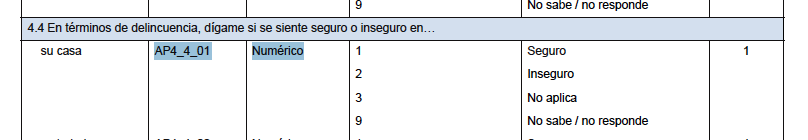
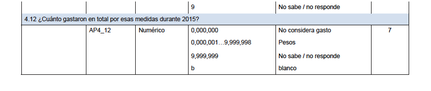

Práctica 5. Más gráficos e intro a estadísticos
================
AE
19/01/2019

Más ggplot &lt;3
----------------

¡Recuerda, poner el directorio!

``` r
setwd("/Users/anaescoto/Dropbox/SFP")
```

En esta práctica vamos a volver a la base de la ENVIPE. Con nuestro paquete foreign

``` r
install.packages("foreign", repos = "http://cran.us.r-project.org", dependencies = TRUE)
```

    ## 
    ## The downloaded binary packages are in
    ##  /var/folders/fr/mw1x21js54367mjdhqsjfwqm0000gn/T//RtmpbgJfRc/downloaded_packages

``` r
library(foreign)
```

Llamamos nuestra base

``` r
TPer_Vic1 <- read.dbf("TPer_Vic1.dbf")
```

Vamos a trabajar con la variable de percepción de seguridad en casa

``` r
table(TPer_Vic1$AP4_4_01)
```

    ## 
    ##     1     2     3     9 
    ## 68843 22620    17    61

Etiquetamos la variable como lo señala descriptor de archivos:  Muchas veces el "NA" en las bases viene marcado, para distingirlo de los NA de pase o que no aplica de los declaratorios. Nosotros vamos a declarar los missings recodificando en una nueva variable

``` r
TPer_Vic1$seguridad_casa<-TPer_Vic1$AP4_4_01
TPer_Vic1$seguridad_casa[TPer_Vic1$AP4_4_01==9]<-NA
```

Vamos a recodificar, hoy sí.

``` r
TPer_Vic1$seguridad_casa<- factor(TPer_Vic1$seguridad_casa,label= c("Seguro", "Inseguro", "No Aplica"))
table(TPer_Vic1$seguridad_casa)
```

    ## 
    ##    Seguro  Inseguro No Aplica 
    ##     68843     22620        17

Hacemos mismo para el sexo

``` r
TPer_Vic1$SEXO<- factor(TPer_Vic1$SEXO,label= c("Hombre", "Mujer"))
table(TPer_Vic1$SEXO)
```

    ## 
    ## Hombre  Mujer 
    ##  42293  49248

Gráficos de comparación cuanti y cuali
======================================

Los gráficos de comparaciones de cajas y distribuciones son muy útiles. Nos permiten ver cómo una variable cuantitativa se comporta entre la población dividida entre los grupos.

Vamos a volver a usar nuestro paquete ggplot2

``` r
install.packages("ggplot2", repos = "http://cran.us.r-project.org", dependencies = TRUE)
```

    ## 
    ## The downloaded binary packages are in
    ##  /var/folders/fr/mw1x21js54367mjdhqsjfwqm0000gn/T//RtmpbgJfRc/downloaded_packages

``` r
library(ggplot2)
```

Vamos a ver cómo se distribuyen los gastos por seguridad  Pero primero recodificamos los missings

``` r
TPer_Vic1$gasto_seg<-as.numeric(paste(TPer_Vic1$AP4_12))
```

    ## Warning: NAs introduced by coercion

``` r
TPer_Vic1$gasto_seg[TPer_Vic1$gasto_seg==9999999]<-NA
```

Vamos a usar la función qplot, otra vez.

<b>Univariado </b>

``` r
q<-qplot(gasto_seg, data=TPer_Vic1, geom="density", 
   main="Distribución de los gastos por seguridad", xlab="Pesos mexicanos", 
   ylab="Density")
q
```

    ## Warning: Removed 56721 rows containing non-finite values (stat_density).


Si transformamos a logaritmo, tenemos una distribución más parecida a una normal

``` r
q<-qplot(log(gasto_seg), data=TPer_Vic1, geom="density", 
   main="Distribución de los gastos en seguridad", xlab="Logaritmo", 
   ylab="Density")
q
```

    ## Warning: Removed 59775 rows containing non-finite values (stat_density).


<b>Bivariado</b>

Podemos comparar la distribución incluyendo en la opción "fill=" y poner la variable que separa a nuestro grupos.

``` r
q<-qplot(log(gasto_seg), data=TPer_Vic1, geom="density", fill=factor(SEXO), alpha=I(.5), 
   main="Distribución de los gastos en seguridad", xlab="Logaritmo", 
   ylab="Density")
q
```

    ## Warning: Removed 59775 rows containing non-finite values (stat_density).


Para poder editar la transparencia de nuestro relleno podemos usar la opción alpha y ponerle un valor menor a 1.

``` r
q<-qplot(log(gasto_seg), data=TPer_Vic1, geom="density", fill=factor(SEXO), alpha=I(.5), 
   main="Distribución de los gastos en seguridad", xlab="Logaritmo", 
   ylab="Density")
q
```

    ## Warning: Removed 59775 rows containing non-finite values (stat_density).


Podemos comparar la distribución incluyendo en la opción "fill" el nombre la de variable que tenemos de grupo. A veces lo mejor es incluirla como un factor, para que nos tome las etiquetas

``` r
q<-qplot(log(gasto_seg), data=TPer_Vic1, geom="histogram", fill=factor(SEXO), alpha=I(.5), 
   main="Distribución de los gastos en seguridad", xlab="Logaritmo", 
   ylab="Frecuencia")
q
```

    ## `stat_bin()` using `bins = 30`. Pick better value with `binwidth`.

    ## Warning: Removed 59775 rows containing non-finite values (stat_bin).


Análisis descriptivo
====================

Un truco para hacer el análisis descriptivo es generar una subbase con las variables que vamos analizar

``` r
mydata<- TPer_Vic1[, c("gasto_seg", "ESTRATO","EDAD", "SEXO", "seguridad_casa")]
tail(mydata)
```

    ##       gasto_seg ESTRATO EDAD   SEXO seguridad_casa
    ## 91536        NA       2   25 Hombre         Seguro
    ## 91537        NA       2   35 Hombre         Seguro
    ## 91538        NA       2   65  Mujer       Inseguro
    ## 91539      5500       2   61  Mujer         Seguro
    ## 91540        NA       2   60 Hombre         Seguro
    ## 91541        NA       2   70  Mujer         Seguro

Volvemos numérica la edad y eliminamos los missings

``` r
mydata$EDAD<-as.numeric(paste(mydata$EDAD))
mydata$EDAD[mydata$EDAD>97]<-NA

TPer_Vic1$EDAD<-as.numeric(paste(TPer_Vic1$EDAD))
TPer_Vic1$EDAD[TPer_Vic1$EDAD>97]<-NA
```

Si queremos obtener las medias de estas tres variables, usamos la función sapply. Esto nos permite repetir la función para todo el data frame Excluyendo missing values

``` r
sapply(mydata, mean, na.rm=TRUE)
```

    ## Warning in mean.default(X[[i]], ...): argument is not numeric or logical:
    ## returning NA

    ## Warning in mean.default(X[[i]], ...): argument is not numeric or logical:
    ## returning NA

    ## Warning in mean.default(X[[i]], ...): argument is not numeric or logical:
    ## returning NA

    ##      gasto_seg        ESTRATO           EDAD           SEXO seguridad_casa 
    ##     6759.54948             NA       42.86013             NA             NA

Además de media (mean) tenemos las siguientes opciones: mean, sd, var, min, max, median, range, and quantile.

Para obtener de una sola vez las funciones mean,median,25th and 75th quartiles,min,max, usamos la función "summary"

``` r
summary(mydata)
```

    ##    gasto_seg       ESTRATO        EDAD           SEXO      
    ##  Min.   :      0   1:17146   Min.   :18.00   Hombre:42293  
    ##  1st Qu.:    500   2:46918   1st Qu.:29.00   Mujer :49248  
    ##  Median :   2000   3:19473   Median :40.00                 
    ##  Mean   :   6760   4: 8004   Mean   :42.86                 
    ##  3rd Qu.:   7000             3rd Qu.:54.00                 
    ##  Max.   :1800000             Max.   :97.00                 
    ##  NA's   :56721               NA's   :459                   
    ##    seguridad_casa 
    ##  Seguro   :68843  
    ##  Inseguro :22620  
    ##  No Aplica:   17  
    ##  NA's     :   61  
    ##                   
    ##                   
    ## 

``` r
summary(mydata[mydata$SEXO=="Hombre",])
```

    ##    gasto_seg      ESTRATO        EDAD           SEXO      
    ##  Min.   :     0   1: 7916   Min.   :18.00   Hombre:42293  
    ##  1st Qu.:   500   2:21843   1st Qu.:29.00   Mujer :    0  
    ##  Median :  3000   3: 8933   Median :40.00                 
    ##  Mean   :  7545   4: 3601   Mean   :42.66                 
    ##  3rd Qu.:  8000             3rd Qu.:54.00                 
    ##  Max.   :500000             Max.   :97.00                 
    ##  NA's   :25677              NA's   :212                   
    ##    seguridad_casa 
    ##  Seguro   :32991  
    ##  Inseguro : 9262  
    ##  No Aplica:   12  
    ##  NA's     :   28  
    ##                   
    ##                   
    ## 

``` r
summary(mydata[mydata$SEXO=="Mujer",])
```

    ##    gasto_seg       ESTRATO        EDAD           SEXO      
    ##  Min.   :      0   1: 9230   Min.   :18.00   Hombre:    0  
    ##  1st Qu.:    500   2:25075   1st Qu.:30.00   Mujer :49248  
    ##  Median :   2000   3:10540   Median :40.00                 
    ##  Mean   :   6043   4: 4403   Mean   :43.03                 
    ##  3rd Qu.:   6000             3rd Qu.:55.00                 
    ##  Max.   :1800000             Max.   :97.00                 
    ##  NA's   :31044               NA's   :247                   
    ##    seguridad_casa 
    ##  Seguro   :35852  
    ##  Inseguro :13358  
    ##  No Aplica:    5  
    ##  NA's     :   33  
    ##                   
    ##                   
    ## 

Tapply, se parece a sapply, nos permite hacer una función en un subconjunto que se deriva de un vector. Por ejemplo, a continuación podemos pedirle al programa que nos haga un summary del ingreso, tomando en cuenta un vector de FAC\_ELE

``` r
tapply(TPer_Vic1$gasto_seg, TPer_Vic1$seguridad_casa, summary)
```

    ## $Seguro
    ##    Min. 1st Qu.  Median    Mean 3rd Qu.    Max.    NA's 
    ##       0     480    2000    6363    6000 1700000   45804 
    ## 
    ## $Inseguro
    ##    Min. 1st Qu.  Median    Mean 3rd Qu.    Max.    NA's 
    ##       0     600    3000    7533    8000 1800000   10860 
    ## 
    ## $`No Aplica`
    ##    Min. 1st Qu.  Median    Mean 3rd Qu.    Max.    NA's 
    ##     300    6150   12000    8100   12000   12000      14

``` r
tapply(TPer_Vic1$gasto_seg, TPer_Vic1$SEXO, summary)
```

    ## $Hombre
    ##    Min. 1st Qu.  Median    Mean 3rd Qu.    Max.    NA's 
    ##       0     500    3000    7545    8000  500000   25677 
    ## 
    ## $Mujer
    ##    Min. 1st Qu.  Median    Mean 3rd Qu.    Max.    NA's 
    ##       0     500    2000    6043    6000 1800000   31044

``` r
tapply(TPer_Vic1$gasto_seg, TPer_Vic1$SEXO, mean, na.rm=T)
```

    ##   Hombre    Mujer 
    ## 7544.987 6042.628

Usando datos expandidos
=======================

Un elemento importante, sobre todo cuando estamos usando una encuesta con representatividad nacional como la ENVIPE DE 2017, es que podemos establecer los valores poblacionales. Para ello, los descriptivos se presentan con los datos de la población y no de la muestra. Esto se hace expandiendo los datos muestrales según el peso o factor de espansión.

En el caso de la enigh este es factor cambia de acuerdo de los módulos "FAC\_ELE"

Para esto usaremos la librería "questionr"

``` r
install.packages("questionr", repos = "http://cran.us.r-project.org", dependencies = TRUE)
```

    ## 
    ## The downloaded binary packages are in
    ##  /var/folders/fr/mw1x21js54367mjdhqsjfwqm0000gn/T//RtmpbgJfRc/downloaded_packages

``` r
library(questionr)
```

Para usar nuestro factor de expansión primero tenemos que verificar qué tipo de valor es en nuestro objeto.

``` r
class(TPer_Vic1$FAC_ELE)
```

    ## [1] "factor"

Si no es numérico, hay que transformarlo a numérico:

``` r
TPer_Vic1$FAC_ELE<-as.numeric(TPer_Vic1$FAC_ELE)
```

Este paquete tiene la función wdt.mean, calcula las medias tomando en cuenta los pesos.

``` r
    wtd.mean(TPer_Vic1$gasto_seg, weights = TPer_Vic1$FAC_ELE, na.rm = TRUE)
```

    ## [1] 6704.553

``` r
#También podemos usar el valor con el comando weighted mean
    weighted.mean(x = TPer_Vic1$gasto_seg, w = TPer_Vic1$FAC_ELE, na.rm = TRUE)
```

    ## [1] 6704.553

Para variables cualitativas podemos hacer tablas con los FAC\_ELEes de expansión

``` r
    wtd.table(TPer_Vic1$SEXO, weights = TPer_Vic1$FAC_ELE)
```

    ##   Hombre    Mujer 
    ## 36070380 41252165

Para una tabla cruzada

``` r
    wtd.table(TPer_Vic1$SEXO,TPer_Vic1$seguridad_casa, weights = TPer_Vic1$FAC_ELE)
```

    ##          Seguro Inseguro No Aplica
    ## Hombre 28262572  7780063      7588
    ## Mujer  30297051 10927878      3251

Mi primera función
==================

Unos de los elementos más poderosos de R es hacer nuestra propias funciones. Y cuando trabajamos bases de datos a veces hacemos un procedimiento que lo queremos repetir. Tal vez para una base de datos, tal vez para una variable, tal vez para grupos de casos.

Para ello haremos una función sencilla. Para sumarle un valor un 1

``` r
mi_funcion<-function(x) {
    x<-x+1
    x
}

mi_funcion(5)
```

    ## [1] 6

Qué tal hoy una una función donde podamos establecer qué valor sumamos

``` r
mi_funcion<-function(x,a) {
    x<-x+a
    x
}

mi_funcion(5,2)
```

    ## [1] 7

Mi función para expandir medias

``` r
expandir<- function(x){
  weighted.mean(x, w = TPer_Vic1$FAC_ELE)
}
```

Entonces puedo ya sólo poner la variable

``` r
expandir(TPer_Vic1$EDAD)
```

    ## [1] NA

``` r
expandir(TPer_Vic1$gasto_seg)
```

    ## [1] NA

Plyr (hermano de dplyr)
=======================

Vamos a instalar el paquete "plyr"

``` r
install.packages("plyr", repos = "http://cran.us.r-project.org", dependencies = TRUE)
```

    ## 
    ## The downloaded binary packages are in
    ##  /var/folders/fr/mw1x21js54367mjdhqsjfwqm0000gn/T//RtmpbgJfRc/downloaded_packages

``` r
library(plyr)
```

Este paquete nos ayuda también tener datos ponderados y poderlos hacer para grupos.

``` r
ddply(TPer_Vic1,.(seguridad_casa),summarise, wm = weighted.mean(gasto_seg,FAC_ELE,na.rm=T))
```

    ##   seguridad_casa       wm
    ## 1         Seguro 6367.231
    ## 2       Inseguro 7397.125
    ## 3      No Aplica 8382.953
    ## 4           <NA> 7312.640

Finalmente, si quisiéramos guardar la base de datos en un su formato. Como hemos colocado el directorio, podemos sólo poner el nombre entre comillas

``` r
write.dbf(TPer_Vic1, "TPer_Vic1_mod.dbf" )
```

Guardando todo nuestro Environment
==================================

``` r
save.image("EnviromentD3.RData")
```
