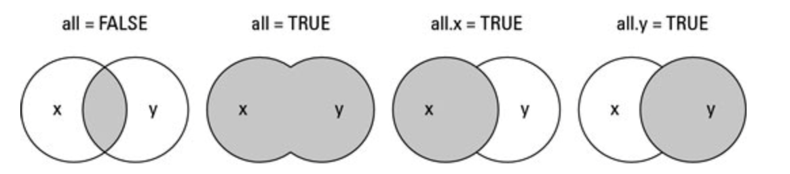

Práctica 8: Merge
================
AE
25/01/2019

Previo
======

Vamos a cargar la base de hogares de la ENVIPE con la que hemos estado trabajando.

¡Recuerda, poner el directorio!

``` r
setwd("/Users/anaescoto/Dropbox/SFP")
install.packages("foreign", repos = "http://cran.us.r-project.org", dependencies = TRUE)
```

    ## 
    ## The downloaded binary packages are in
    ##  /var/folders/fr/mw1x21js54367mjdhqsjfwqm0000gn/T//Rtmprwivlw/downloaded_packages

``` r
library(foreign)

TPer_Vic1 <- read.dbf("TPer_Vic1_mod.dbf")
```

Juntando bases
==============

Muchas bases de datos están organizadas en varias tablas. La ventaja de la programación por objetos de R, nos permite tener las bases cargadas en nuestro ambiente y llamarlas y juntarlas cuando sea necesario.

Vamos a suponer que necesitamos usar información de la tabla de viviendas de la ENVIPE-2018, de México, con la información a nivel de individuos que hemos estado utilizando.

Entonces cargamos la base de viviendas (la puedes bajar de INEGI , o del sitio "Base de datos" del Curso)

``` r
TVivienda<- read.dbf("TVivienda.dbf")
dim(TVivienda)
```

    ## [1] 89572    20

Para juntar bases usamos el comando "merge" En "by" ponemos el id, correspondiente a la variable o variables que forman el id, entrecomillado. Cuando estamos mezclando bases del mismo nivel de análisis el id es igual en ambas bases. Cuando estamos incoporando información de bases de distinto nivel debemos escoger En general ponemos el id de la base de mayor nivel. En este caso, sabemos que a una vivienda corresponde más de un hogar. Tal como revisamos nuestra documentación, sabemos que el id de la tabla viviendas es "ID\_VIV"

``` r
THogar <- read.dbf("THogar.dbf")
dim(THogar)
```

    ## [1] 91664    18

``` r
merge_data<- merge(TVivienda, THogar, by="ID_VIV")
```

Revisemos la base creada

``` r
names(merge_data)
```

    ##  [1] "ID_VIV"     "UPM.x"      "VIV_SEL.x"  "AREAM"      "CVE_ENT.x" 
    ##  [6] "NOM_ENT.x"  "CVE_MUN.x"  "NOM_MUN.x"  "RESULT_V"   "AP1_1"     
    ## [11] "AP1_2"      "AP2_1"      "AP2_2"      "AP2_3"      "NAP2_3"    
    ## [16] "FAC_VIV"    "FAC_VIV_AM" "DOMINIO.x"  "EST_DIS.x"  "UPM_DIS.x" 
    ## [21] "ID_HOG"     "UPM.y"      "VIV_SEL.y"  "HOGAR"      "RESUL_H"   
    ## [26] "N_INF"      "R_SEL"      "CVE_ENT.y"  "NOM_ENT.y"  "CVE_MUN.y" 
    ## [31] "NOM_MUN.y"  "TOT_PER"    "FAC_HOG"    "FAC_HOG_AM" "DOMINIO.y" 
    ## [36] "EST_DIS.y"  "UPM_DIS.y"

``` r
dim(merge_data)
```

    ## [1] 91664    37

¿Qué observas?

1.  El orden de las variables corresponde al orden que pusimos las bases en las opciones.

2.  También vemos que las variables que se repetían en ambas bases se repiten en la nueva base, seguida de un un punto y una "x", para lo que proviene de la primera base y con una "y", lo que proviene de la segunda. R dejará las variables intactas y son coincidentes, en nuestro caso, porque las variables son iguales. R hace esto para precaver que por error tengamos alguna variable con un nombre igual y no sea la misma

Revisemos que las variables "repetidas son iguales

``` r
table(merge_data$CVE_ENT.x, merge_data$CVE_ENT.y)
```

    ##     
    ##        01   02   03   04   05   06   07   08   09   10   11   12   13   14
    ##   01 1798    0    0    0    0    0    0    0    0    0    0    0    0    0
    ##   02    0 2600    0    0    0    0    0    0    0    0    0    0    0    0
    ##   03    0    0 2694    0    0    0    0    0    0    0    0    0    0    0
    ##   04    0    0    0 2259    0    0    0    0    0    0    0    0    0    0
    ##   05    0    0    0    0 2646    0    0    0    0    0    0    0    0    0
    ##   06    0    0    0    0    0 3120    0    0    0    0    0    0    0    0
    ##   07    0    0    0    0    0    0 3657    0    0    0    0    0    0    0
    ##   08    0    0    0    0    0    0    0 3365    0    0    0    0    0    0
    ##   09    0    0    0    0    0    0    0    0 5696    0    0    0    0    0
    ##   10    0    0    0    0    0    0    0    0    0 2920    0    0    0    0
    ##   11    0    0    0    0    0    0    0    0    0    0 2425    0    0    0
    ##   12    0    0    0    0    0    0    0    0    0    0    0 2523    0    0
    ##   13    0    0    0    0    0    0    0    0    0    0    0    0 2644    0
    ##   14    0    0    0    0    0    0    0    0    0    0    0    0    0 2726
    ##   15    0    0    0    0    0    0    0    0    0    0    0    0    0    0
    ##   16    0    0    0    0    0    0    0    0    0    0    0    0    0    0
    ##   17    0    0    0    0    0    0    0    0    0    0    0    0    0    0
    ##   18    0    0    0    0    0    0    0    0    0    0    0    0    0    0
    ##   19    0    0    0    0    0    0    0    0    0    0    0    0    0    0
    ##   20    0    0    0    0    0    0    0    0    0    0    0    0    0    0
    ##   21    0    0    0    0    0    0    0    0    0    0    0    0    0    0
    ##   22    0    0    0    0    0    0    0    0    0    0    0    0    0    0
    ##   23    0    0    0    0    0    0    0    0    0    0    0    0    0    0
    ##   24    0    0    0    0    0    0    0    0    0    0    0    0    0    0
    ##   25    0    0    0    0    0    0    0    0    0    0    0    0    0    0
    ##   26    0    0    0    0    0    0    0    0    0    0    0    0    0    0
    ##   27    0    0    0    0    0    0    0    0    0    0    0    0    0    0
    ##   28    0    0    0    0    0    0    0    0    0    0    0    0    0    0
    ##   29    0    0    0    0    0    0    0    0    0    0    0    0    0    0
    ##   30    0    0    0    0    0    0    0    0    0    0    0    0    0    0
    ##   31    0    0    0    0    0    0    0    0    0    0    0    0    0    0
    ##   32    0    0    0    0    0    0    0    0    0    0    0    0    0    0
    ##     
    ##        15   16   17   18   19   20   21   22   23   24   25   26   27   28
    ##   01    0    0    0    0    0    0    0    0    0    0    0    0    0    0
    ##   02    0    0    0    0    0    0    0    0    0    0    0    0    0    0
    ##   03    0    0    0    0    0    0    0    0    0    0    0    0    0    0
    ##   04    0    0    0    0    0    0    0    0    0    0    0    0    0    0
    ##   05    0    0    0    0    0    0    0    0    0    0    0    0    0    0
    ##   06    0    0    0    0    0    0    0    0    0    0    0    0    0    0
    ##   07    0    0    0    0    0    0    0    0    0    0    0    0    0    0
    ##   08    0    0    0    0    0    0    0    0    0    0    0    0    0    0
    ##   09    0    0    0    0    0    0    0    0    0    0    0    0    0    0
    ##   10    0    0    0    0    0    0    0    0    0    0    0    0    0    0
    ##   11    0    0    0    0    0    0    0    0    0    0    0    0    0    0
    ##   12    0    0    0    0    0    0    0    0    0    0    0    0    0    0
    ##   13    0    0    0    0    0    0    0    0    0    0    0    0    0    0
    ##   14    0    0    0    0    0    0    0    0    0    0    0    0    0    0
    ##   15 2637    0    0    0    0    0    0    0    0    0    0    0    0    0
    ##   16    0 3805    0    0    0    0    0    0    0    0    0    0    0    0
    ##   17    0    0 2657    0    0    0    0    0    0    0    0    0    0    0
    ##   18    0    0    0 1856    0    0    0    0    0    0    0    0    0    0
    ##   19    0    0    0    0 2723    0    0    0    0    0    0    0    0    0
    ##   20    0    0    0    0    0 2838    0    0    0    0    0    0    0    0
    ##   21    0    0    0    0    0    0 3609    0    0    0    0    0    0    0
    ##   22    0    0    0    0    0    0    0 2764    0    0    0    0    0    0
    ##   23    0    0    0    0    0    0    0    0 2597    0    0    0    0    0
    ##   24    0    0    0    0    0    0    0    0    0 1817    0    0    0    0
    ##   25    0    0    0    0    0    0    0    0    0    0 3714    0    0    0
    ##   26    0    0    0    0    0    0    0    0    0    0    0 1820    0    0
    ##   27    0    0    0    0    0    0    0    0    0    0    0    0 3154    0
    ##   28    0    0    0    0    0    0    0    0    0    0    0    0    0 3753
    ##   29    0    0    0    0    0    0    0    0    0    0    0    0    0    0
    ##   30    0    0    0    0    0    0    0    0    0    0    0    0    0    0
    ##   31    0    0    0    0    0    0    0    0    0    0    0    0    0    0
    ##   32    0    0    0    0    0    0    0    0    0    0    0    0    0    0
    ##     
    ##        29   30   31   32
    ##   01    0    0    0    0
    ##   02    0    0    0    0
    ##   03    0    0    0    0
    ##   04    0    0    0    0
    ##   05    0    0    0    0
    ##   06    0    0    0    0
    ##   07    0    0    0    0
    ##   08    0    0    0    0
    ##   09    0    0    0    0
    ##   10    0    0    0    0
    ##   11    0    0    0    0
    ##   12    0    0    0    0
    ##   13    0    0    0    0
    ##   14    0    0    0    0
    ##   15    0    0    0    0
    ##   16    0    0    0    0
    ##   17    0    0    0    0
    ##   18    0    0    0    0
    ##   19    0    0    0    0
    ##   20    0    0    0    0
    ##   21    0    0    0    0
    ##   22    0    0    0    0
    ##   23    0    0    0    0
    ##   24    0    0    0    0
    ##   25    0    0    0    0
    ##   26    0    0    0    0
    ##   27    0    0    0    0
    ##   28    0    0    0    0
    ##   29 2307    0    0    0
    ##   30    0 3578    0    0
    ##   31    0    0 3118    0
    ##   32    0    0    0 1844

Merge hogar a población (id compuesto)
======================================

Hoy queremos incorporar la información de hogar a la base de población entrevistatada (por ejemplo la que hemos estado trababjando TPer\_Vic1)

Aquí es más evidente la diferencia del nivel de las bases de las bases porque hay 91,541 personas entrevistadas en el módulo, en 91,664 hogares en 89,572 viviendas

Tal como está en la documentación de la ENVIPE (<https://www.inegi.org.mx/contenidos/programas/envipe/2017/doc/fd_envipe2017.pdf>), el id o llave única de las bases son las siguientes

Hogares {hogares} es "ID\_VIV" "HOGAR" Selección {individuos} es "ID\_VIV" "HOGAR" "R\_SEL"

Esto significa que tenemos un id compuesto. No es una sola variable. Para esto modificamos ligeramente cómo ponemos el "by", pero siempre eligiendo el id de la base de mayor nivel. (Tené cuidado con los paréntesis)

``` r
merge_data2<- merge(THogar, TPer_Vic1, by=c("ID_VIV","HOGAR"))
dim(merge_data2)
```

    ## [1] 91541   204

Revisemos la base

``` r
str(merge_data2)
```

    ## 'data.frame':    91541 obs. of  204 variables:
    ##  $ ID_VIV      : Factor w/ 89572 levels "0100008.01","0100008.02",..: 1 2 3 4 5 6 7 8 9 10 ...
    ##  $ HOGAR       : Factor w/ 6 levels "01","02","03",..: 1 1 1 1 1 1 1 1 1 1 ...
    ##  $ ID_HOG.x    : Factor w/ 91664 levels "0100008.01.01",..: 1 2 3 4 5 6 7 8 9 10 ...
    ##  $ UPM.x       : Factor w/ 13191 levels "0100008","0100022",..: 1 1 1 1 2 2 2 2 3 3 ...
    ##  $ VIV_SEL.x   : Factor w/ 26 levels "01","02","03",..: 1 2 4 5 2 3 4 5 1 3 ...
    ##  $ RESUL_H.x   : Factor w/ 4 levels "A","B","C","D": 2 2 2 2 1 1 2 1 2 1 ...
    ##  $ N_INF       : Factor w/ 16 levels "01","02","03",..: 2 1 1 1 1 1 1 5 2 2 ...
    ##  $ R_SEL.x     : Factor w/ 15 levels "01","02","03",..: 4 1 2 1 1 2 2 1 2 1 ...
    ##  $ CVE_ENT.x   : Factor w/ 32 levels "01","02","03",..: 1 1 1 1 1 1 1 1 1 1 ...
    ##  $ NOM_ENT.x   : Factor w/ 32 levels "Aguascalientes",..: 1 1 1 1 1 1 1 1 1 1 ...
    ##  $ CVE_MUN.x   : Factor w/ 242 levels "001","002","003",..: 1 1 1 1 1 1 1 1 1 1 ...
    ##  $ NOM_MUN.x   : Factor w/ 1078 levels "Abalá","Abasolo",..: 23 23 23 23 23 23 23 23 23 23 ...
    ##  $ TOT_PER     : Factor w/ 20 levels "01","02","03",..: 4 1 2 3 2 3 2 5 4 3 ...
    ##  $ FAC_HOG.x   : Factor w/ 1376 levels "000000","000031",..: 183 183 183 183 172 172 172 172 186 186 ...
    ##  $ FAC_HOG_AM.x: Factor w/ 1277 levels "000000","000031",..: 179 179 179 179 168 168 168 168 182 182 ...
    ##  $ DOMINIO.x   : Factor w/ 3 levels "C","R","U": 3 3 3 3 3 3 3 3 3 3 ...
    ##  $ EST_DIS.x   : Factor w/ 595 levels "001","002","003",..: 3 3 3 3 2 2 2 2 2 2 ...
    ##  $ UPM_DIS.x   : Factor w/ 13191 levels "00001","00002",..: 1 1 1 1 2 2 2 2 3 3 ...
    ##  $ ID_HOG.y    : Factor w/ 91541 levels "0100008.01.01",..: 1 2 3 4 5 6 7 8 9 10 ...
    ##  $ ID_PER      : Factor w/ 91541 levels "0100008.01.01.04",..: 1 2 3 4 5 6 7 8 9 10 ...
    ##  $ UPM.y       : Factor w/ 13191 levels "0100008","0100022",..: 1 1 1 1 2 2 2 2 3 3 ...
    ##  $ VIV_SEL.y   : Factor w/ 26 levels "01","02","03",..: 1 2 4 5 2 3 4 5 1 3 ...
    ##  $ RESUL_H.y   : Factor w/ 2 levels "A","B": 2 2 2 2 1 1 2 1 2 1 ...
    ##  $ R_SEL.y     : Factor w/ 15 levels "01","02","03",..: 4 1 2 1 1 2 2 1 2 1 ...
    ##  $ SEXO        : Factor w/ 2 levels "Hombre","Mujer": 2 1 1 2 2 1 2 2 2 1 ...
    ##  $ EDAD        : num  37 68 25 56 41 39 75 70 60 27 ...
    ##  $ AREAM       : Factor w/ 33 levels "01","02","03",..: 13 13 13 13 13 13 13 13 13 13 ...
    ##  $ CVE_ENT.y   : Factor w/ 32 levels "01","02","03",..: 1 1 1 1 1 1 1 1 1 1 ...
    ##  $ NOM_ENT.y   : Factor w/ 32 levels "Aguascalientes",..: 1 1 1 1 1 1 1 1 1 1 ...
    ##  $ CVE_MUN.y   : Factor w/ 242 levels "001","002","003",..: 1 1 1 1 1 1 1 1 1 1 ...
    ##  $ NOM_MUN.y   : Factor w/ 1078 levels "Abalá","Abasolo",..: 23 23 23 23 23 23 23 23 23 23 ...
    ##  $ AP4_1       : Factor w/ 4 levels "1","2","3","9": 3 3 3 3 1 3 3 3 3 3 ...
    ##  $ AP4_2_01    : Factor w/ 2 levels "0","1": 1 1 1 2 1 2 2 2 1 1 ...
    ##  $ AP4_2_02    : Factor w/ 2 levels "0","1": 2 2 2 2 2 1 1 1 1 1 ...
    ##  $ AP4_2_03    : Factor w/ 2 levels "0","1": 1 1 1 1 1 1 2 2 1 2 ...
    ##  $ AP4_2_04    : Factor w/ 2 levels "0","1": 1 1 2 2 1 1 1 1 2 2 ...
    ##  $ AP4_2_05    : Factor w/ 2 levels "0","1": 1 2 1 1 2 1 2 1 2 1 ...
    ##  $ AP4_2_06    : Factor w/ 2 levels "0","1": 1 1 1 1 1 1 1 1 1 1 ...
    ##  $ AP4_2_07    : Factor w/ 2 levels "0","1": 1 1 1 1 1 2 1 1 2 1 ...
    ##  $ AP4_2_08    : Factor w/ 2 levels "0","1": 1 2 1 1 2 1 1 1 1 1 ...
    ##  $ AP4_2_09    : Factor w/ 2 levels "0","1": 2 1 2 1 1 1 1 2 1 1 ...
    ##  $ AP4_2_10    : Factor w/ 2 levels "0","1": 1 1 1 1 1 1 1 1 1 1 ...
    ##  $ AP4_2_11    : Factor w/ 2 levels "0","1": 2 1 1 1 1 2 1 1 1 2 ...
    ##  $ AP4_2_12    : Factor w/ 2 levels "0","1": 1 1 1 1 1 1 1 1 1 1 ...
    ##  $ AP4_2_99    : Factor w/ 2 levels "0","1": 1 1 1 1 1 1 1 1 1 1 ...
    ##  $ AP4_3_1     : Factor w/ 3 levels "1","2","9": 1 2 1 1 2 2 1 1 2 2 ...
    ##  $ AP4_3_2     : Factor w/ 3 levels "1","2","9": 1 2 1 2 2 2 2 1 2 2 ...
    ##  $ AP4_3_3     : Factor w/ 3 levels "1","2","9": 1 2 1 2 2 2 2 1 2 2 ...
    ##  $ AP4_4_01    : Factor w/ 4 levels "1","2","3","9": 1 2 1 1 2 2 1 1 2 1 ...
    ##  $ AP4_4_02    : Factor w/ 4 levels "1","2","3","9": 3 3 1 2 3 2 3 3 3 1 ...
    ##  $ AP4_4_03    : Factor w/ 4 levels "1","2","3","9": 1 1 1 1 2 2 2 1 1 1 ...
    ##  $ AP4_4_04    : Factor w/ 4 levels "1","2","3","9": 3 3 3 3 3 3 3 3 3 3 ...
    ##  $ AP4_4_05    : Factor w/ 4 levels "1","2","3","9": 1 1 1 2 2 2 2 1 1 1 ...
    ##  $ AP4_4_06    : Factor w/ 4 levels "1","2","3","9": 1 3 1 2 2 2 2 1 3 1 ...
    ##  $ AP4_4_07    : Factor w/ 4 levels "1","2","3","9": 3 3 1 2 2 2 3 3 3 3 ...
    ##  $ AP4_4_08    : Factor w/ 4 levels "1","2","3","9": 2 3 1 2 2 3 3 1 3 3 ...
    ##  $ AP4_4_09    : Factor w/ 4 levels "1","2","3","9": 2 2 3 2 3 2 3 1 1 3 ...
    ##  $ AP4_4_10    : Factor w/ 4 levels "1","2","3","9": 1 3 1 1 2 3 2 1 3 1 ...
    ##  $ AP4_4_11    : Factor w/ 4 levels "1","2","3","9": 1 3 1 1 2 3 2 2 3 1 ...
    ##  $ AP4_4_12    : Factor w/ 4 levels "1","2","3","9": 3 3 3 3 2 2 3 3 3 3 ...
    ##  $ AP4_5_01    : Factor w/ 2 levels "0","1": 1 1 1 1 2 1 1 1 2 2 ...
    ##  $ AP4_5_02    : Factor w/ 2 levels "0","1": 1 1 1 1 2 1 1 1 1 2 ...
    ##  $ AP4_5_03    : Factor w/ 2 levels "0","1": 1 1 1 1 1 1 1 1 1 1 ...
    ##  $ AP4_5_04    : Factor w/ 2 levels "0","1": 2 1 1 1 1 1 1 1 1 1 ...
    ##  $ AP4_5_05    : Factor w/ 2 levels "0","1": 1 1 1 1 2 1 1 1 1 1 ...
    ##  $ AP4_5_06    : Factor w/ 2 levels "0","1": 2 1 1 1 2 1 1 1 1 2 ...
    ##  $ AP4_5_07    : Factor w/ 2 levels "0","1": 1 1 1 1 2 1 1 1 1 1 ...
    ##  $ AP4_5_08    : Factor w/ 2 levels "0","1": 2 1 2 1 1 2 1 1 1 2 ...
    ##  $ AP4_5_09    : Factor w/ 2 levels "0","1": 1 1 1 1 2 1 2 1 1 2 ...
    ##  $ AP4_5_10    : Factor w/ 2 levels "0","1": 2 1 1 1 1 1 1 1 1 2 ...
    ##  $ AP4_5_11    : Factor w/ 2 levels "0","1": 1 1 1 1 1 1 1 1 1 1 ...
    ##  $ AP4_5_12    : Factor w/ 2 levels "0","1": 1 1 1 1 1 1 1 1 1 1 ...
    ##  $ AP4_5_13    : Factor w/ 2 levels "0","1": 1 1 1 1 1 1 1 1 1 2 ...
    ##  $ AP4_5_14    : Factor w/ 2 levels "0","1": 1 1 1 1 2 1 1 1 1 2 ...
    ##  $ AP4_5_15    : Factor w/ 2 levels "0","1": 1 1 1 1 2 1 1 1 1 1 ...
    ##  $ AP4_5_16    : Factor w/ 2 levels "0","1": 1 2 1 2 1 1 1 2 1 1 ...
    ##  $ AP4_5_99    : Factor w/ 2 levels "0","1": 1 1 1 1 1 1 1 1 1 1 ...
    ##  $ AP4_6_1     : Factor w/ 4 levels "1","2","3","9": 2 2 2 1 1 1 1 2 1 1 ...
    ##  $ AP4_6_2     : Factor w/ 4 levels "1","2","3","9": 2 2 2 2 2 1 2 2 2 2 ...
    ##  $ AP4_6_3     : Factor w/ 4 levels "1","2","3","9": 2 2 2 2 1 1 1 2 2 2 ...
    ##  $ AP4_7_1     : Factor w/ 5 levels "1","2","3","4",..: 1 3 2 2 4 3 4 2 3 4 ...
    ##  $ AP4_7_2     : Factor w/ 5 levels "1","2","3","4",..: 1 1 2 2 4 3 4 2 3 4 ...
    ##  $ AP4_7_3     : Factor w/ 5 levels "1","2","3","4",..: 1 1 4 3 4 3 4 5 3 4 ...
    ##  $ AP4_8_1     : Factor w/ 4 levels "1","2","3","9": 2 1 1 1 1 1 2 2 2 2 ...
    ##  $ AP4_9_1     : Factor w/ 3 levels "1","2","9": NA 1 2 2 1 3 NA NA NA NA ...
    ##  $ AP4_8_2     : Factor w/ 4 levels "1","2","3","9": 1 2 1 1 1 1 1 2 1 2 ...
    ##  $ AP4_9_2     : Factor w/ 3 levels "1","2","9": 1 NA 2 2 1 2 2 NA 2 NA ...
    ##  $ AP4_8_3     : Factor w/ 4 levels "1","2","3","9": 1 2 1 1 1 2 2 2 2 2 ...
    ##  $ AP4_9_3     : Factor w/ 3 levels "1","2","9": 2 NA 2 2 2 NA NA NA NA NA ...
    ##  $ AP4_8_4     : Factor w/ 4 levels "1","2","3","9": 2 2 2 2 1 2 2 2 2 1 ...
    ##  $ AP4_9_4     : Factor w/ 3 levels "1","2","9": NA NA NA NA 1 NA NA NA NA 2 ...
    ##  $ AP4_8_5     : Factor w/ 4 levels "1","2","3","9": 2 2 2 1 1 1 1 2 2 1 ...
    ##  $ AP4_9_5     : Factor w/ 3 levels "1","2","9": NA NA NA 2 1 2 2 NA NA 2 ...
    ##  $ AP4_8_6     : Factor w/ 4 levels "1","2","3","9": 2 3 1 3 3 1 3 2 2 3 ...
    ##  $ AP4_9_6     : Factor w/ 3 levels "1","2","9": NA NA 2 NA NA 2 NA NA NA NA ...
    ##  $ AP4_10_01   : Factor w/ 4 levels "1","2","3","9": 2 1 2 2 1 1 2 3 2 2 ...
    ##  $ AP4_10_02   : Factor w/ 4 levels "1","2","3","9": 3 3 3 3 1 1 2 3 3 3 ...
    ##  $ AP4_10_03   : Factor w/ 4 levels "1","2","3","9": 2 1 2 2 1 1 2 3 2 2 ...
    ##  $ AP4_10_04   : Factor w/ 4 levels "1","2","3","9": 2 2 3 2 3 2 2 3 2 2 ...
    ##   [list output truncated]

``` r
tail(merge_data2)
```

    ##           ID_VIV HOGAR      ID_HOG.x   UPM.x VIV_SEL.x RESUL_H.x N_INF
    ## 91536 3260801.12    01 3260801.12.01 3260801        12         B    01
    ## 91537 3260801.13    01 3260801.13.01 3260801        13         B    02
    ## 91538 3260801.15    01 3260801.15.01 3260801        15         A    01
    ## 91539 3260801.16    01 3260801.16.01 3260801        16         A    01
    ## 91540 3260801.17    01 3260801.17.01 3260801        17         B    02
    ## 91541 3260801.19    01 3260801.19.01 3260801        19         B    02
    ##       R_SEL.x CVE_ENT.x NOM_ENT.x CVE_MUN.x             NOM_MUN.x TOT_PER
    ## 91536      02        32 Zacatecas       058 Santa María de la Paz      02
    ## 91537      01        32 Zacatecas       058 Santa María de la Paz      05
    ## 91538      02        32 Zacatecas       058 Santa María de la Paz      02
    ## 91539      01        32 Zacatecas       058 Santa María de la Paz      01
    ## 91540      01        32 Zacatecas       058 Santa María de la Paz      02
    ## 91541      02        32 Zacatecas       058 Santa María de la Paz      03
    ##       FAC_HOG.x FAC_HOG_AM.x DOMINIO.x EST_DIS.x UPM_DIS.x      ID_HOG.y
    ## 91536    000199         <NA>         R       595     13208 3260801.12.01
    ## 91537    000199         <NA>         R       595     13208 3260801.13.01
    ## 91538    000199         <NA>         R       595     13208 3260801.15.01
    ## 91539    000199         <NA>         R       595     13208 3260801.16.01
    ## 91540    000199         <NA>         R       595     13208 3260801.17.01
    ## 91541    000199         <NA>         R       595     13208 3260801.19.01
    ##                 ID_PER   UPM.y VIV_SEL.y RESUL_H.y R_SEL.y   SEXO EDAD
    ## 91536 3260801.12.01.02 3260801        12         B      02 Hombre   25
    ## 91537 3260801.13.01.01 3260801        13         B      01 Hombre   35
    ## 91538 3260801.15.01.02 3260801        15         A      02  Mujer   65
    ## 91539 3260801.16.01.01 3260801        16         A      01  Mujer   61
    ## 91540 3260801.17.01.01 3260801        17         B      01 Hombre   60
    ## 91541 3260801.19.01.02 3260801        19         B      02  Mujer   70
    ##       AREAM CVE_ENT.y NOM_ENT.y CVE_MUN.y             NOM_MUN.y AP4_1
    ## 91536  <NA>        32 Zacatecas       058 Santa María de la Paz     3
    ## 91537  <NA>        32 Zacatecas       058 Santa María de la Paz     3
    ## 91538  <NA>        32 Zacatecas       058 Santa María de la Paz     3
    ## 91539  <NA>        32 Zacatecas       058 Santa María de la Paz     3
    ## 91540  <NA>        32 Zacatecas       058 Santa María de la Paz     3
    ## 91541  <NA>        32 Zacatecas       058 Santa María de la Paz     3
    ##       AP4_2_01 AP4_2_02 AP4_2_03 AP4_2_04 AP4_2_05 AP4_2_06 AP4_2_07
    ## 91536        0        0        0        1        0        0        0
    ## 91537        1        1        0        0        0        0        0
    ## 91538        1        1        0        0        0        0        0
    ## 91539        0        0        0        1        1        0        0
    ## 91540        0        0        0        1        1        0        0
    ## 91541        0        0        0        1        0        0        0
    ##       AP4_2_08 AP4_2_09 AP4_2_10 AP4_2_11 AP4_2_12 AP4_2_99 AP4_3_1
    ## 91536        1        0        0        1        0        0       1
    ## 91537        0        1        0        0        0        0       1
    ## 91538        0        0        1        0        0        0       2
    ## 91539        0        1        0        0        0        0       2
    ## 91540        0        1        0        0        0        0       2
    ## 91541        0        0        1        1        0        0       1
    ##       AP4_3_2 AP4_3_3 AP4_4_01 AP4_4_02 AP4_4_03 AP4_4_04 AP4_4_05
    ## 91536       1       1        1        1        1        3        3
    ## 91537       1       2        1        1        1        3        3
    ## 91538       2       2        2        3        2        3        2
    ## 91539       2       2        1        2        2        3        1
    ## 91540       2       2        1        1        1        3        2
    ## 91541       1       2        1        3        1        3        3
    ##       AP4_4_06 AP4_4_07 AP4_4_08 AP4_4_09 AP4_4_10 AP4_4_11 AP4_4_12
    ## 91536        3        1        1        1        1        1        1
    ## 91537        3        3        3        1        1        2        1
    ## 91538        3        2        2        2        2        2        3
    ## 91539        3        1        1        1        1        1        1
    ## 91540        3        2        2        3        1        1        3
    ## 91541        3        3        3        1        3        2        3
    ##       AP4_5_01 AP4_5_02 AP4_5_03 AP4_5_04 AP4_5_05 AP4_5_06 AP4_5_07
    ## 91536        1        0        0        0        0        0        0
    ## 91537        1        0        1        0        1        0        0
    ## 91538        1        0        1        0        1        0        0
    ## 91539        1        0        0        0        1        0        0
    ## 91540        1        0        0        0        0        0        0
    ## 91541        0        0        0        0        0        0        0
    ##       AP4_5_08 AP4_5_09 AP4_5_10 AP4_5_11 AP4_5_12 AP4_5_13 AP4_5_14
    ## 91536        0        0        0        0        0        0        0
    ## 91537        1        1        0        0        0        0        0
    ## 91538        1        0        1        0        0        1        1
    ## 91539        0        1        0        0        0        0        0
    ## 91540        1        1        1        0        1        1        0
    ## 91541        0        0        0        0        0        0        0
    ##       AP4_5_15 AP4_5_16 AP4_5_99 AP4_6_1 AP4_6_2 AP4_6_3 AP4_7_1 AP4_7_2
    ## 91536        1        0        0       2       1       1       2       3
    ## 91537        1        0        0       2       2       2       2       3
    ## 91538        0        0        0       9       9       9       4       4
    ## 91539        0        0        0       2       2       2       3       4
    ## 91540        0        0        0       1       2       1       3       4
    ## 91541        0        1        0       2       2       2       9       9
    ##       AP4_7_3 AP4_8_1 AP4_9_1 AP4_8_2 AP4_9_2 AP4_8_3 AP4_9_3 AP4_8_4
    ## 91536       3       2    <NA>       2    <NA>       2    <NA>       2
    ## 91537       3       2    <NA>       2    <NA>       2    <NA>       2
    ## 91538       4       1       2       2    <NA>       2    <NA>       2
    ## 91539       4       2    <NA>       2    <NA>       1       2       2
    ## 91540       4       2    <NA>       2    <NA>       2    <NA>       2
    ## 91541       9       2    <NA>       2    <NA>       2    <NA>       2
    ##       AP4_9_4 AP4_8_5 AP4_9_5 AP4_8_6 AP4_9_6 AP4_10_01 AP4_10_02
    ## 91536    <NA>       1       2       2    <NA>         1         3
    ## 91537    <NA>       2    <NA>       2    <NA>         2         1
    ## 91538    <NA>       2    <NA>       2    <NA>         2         3
    ## 91539    <NA>       1       2       2    <NA>         1         3
    ## 91540    <NA>       2    <NA>       2    <NA>         2         3
    ## 91541    <NA>       2    <NA>       2    <NA>         2         3
    ##       AP4_10_03 AP4_10_04 AP4_10_05 AP4_10_06 AP4_10_07 AP4_10_08
    ## 91536         2         3         3         2         3         3
    ## 91537         2         3         2         2         3         3
    ## 91538         2         2         2         2         3         3
    ## 91539         2         2         2         1         3         3
    ## 91540         1         2         2         1         3         3
    ## 91541         2         3         2         2         3         3
    ##       AP4_10_09 AP4_10_10 AP4_10_11 AP4_10_12 AP4_10_13 AP4_10_14
    ## 91536         2         3         2         3         3         3
    ## 91537         2         3         2         3         2         3
    ## 91538         2         3         3         3         3         3
    ## 91539         2         1         2         2         3         2
    ## 91540         1         3         1         3         3         2
    ## 91541         2         3         3         3         3         3
    ##       AP4_10_15 AP4_11_01 AP4_11_02 AP4_11_03 AP4_11_04 AP4_11_05
    ## 91536         2         2         2         2         2         2
    ## 91537         2         2         2         2         2         2
    ## 91538         2         2         2         2         2         2
    ## 91539         2         1         1         1         1         2
    ## 91540         2         2         2         2         2         2
    ## 91541         3         2         2         2         2         2
    ##       AP4_11_06 AP4_11_07 AP4_11_08 AP4_11_09 AP4_11_10 AP4_11_11  AP4_12
    ## 91536         2         2         2         2         2         9    <NA>
    ## 91537         2         2         2         2         2         9    <NA>
    ## 91538         2         2         2         2         2         9    <NA>
    ## 91539         1         2         2         2         2         9 0005500
    ## 91540         2         2         2         2         2         9    <NA>
    ## 91541         2         2         2         2         2         9    <NA>
    ##       AP5_1_01 AP5_1_02 AP5_1_03 AP5_1_04 AP5_1_05 AP5_1_06 AP5_1_07
    ## 91536        1        1        1        2        1        3        3
    ## 91537        1        1        1        1        1        3        3
    ## 91538        1        1        3        3        3        3        3
    ## 91539        1        1        1        1        1        3        3
    ## 91540        1        3        3        1        3        2        2
    ## 91541        2        2        1        2        2        3        3
    ##       AP5_1_08 AP5_1_09 AP5_1_10 AP5_1_11 AP5_1_12 AP5_1_13 AP5_2_1
    ## 91536        3        2        2        2        2        9       2
    ## 91537        3        1        1        1        1        3       2
    ## 91538        1        3        3        3        3        9       3
    ## 91539        1        1        3        3        3        9       1
    ## 91540        2        2        2        3        3        9       3
    ## 91541        2        2        2        2        2        9       2
    ##       AP5_2_2 AP5_2_3 AP5_2_4 AP5_3_01 AP5_4_01 AP5_4_01_C AP5_5_01
    ## 91536       1       2       2        2     <NA>       <NA>     <NA>
    ## 91537       1       1       1        2     <NA>       <NA>     <NA>
    ## 91538       5       1       5        2     <NA>       <NA>     <NA>
    ## 91539       5       1       1        2     <NA>       <NA>     <NA>
    ## 91540       5       1       1        2     <NA>       <NA>     <NA>
    ## 91541       5       2       5        2     <NA>       <NA>     <NA>
    ##       AP5_6_01 AP5_7_1 AP5_3_02 AP5_4_02 AP5_4_02_C AP5_5_02 AP5_6_02
    ## 91536     <NA>    <NA>        1        2          3        2        2
    ## 91537     <NA>    <NA>        1        1          1        2        1
    ## 91538     <NA>    <NA>        1        2          4        2        4
    ## 91539     <NA>    <NA>        1        2          1        2        2
    ## 91540     <NA>    <NA>        1        2          2        2        2
    ## 91541     <NA>    <NA>        2     <NA>       <NA>     <NA>     <NA>
    ##       AP5_7_2 AP5_3_03 AP5_4_03 AP5_4_03_C AP5_5_03 AP5_6_03 AP5_7_3
    ## 91536       2        1        1          3        2        1       1
    ## 91537       1        1        2          3        2        2       1
    ## 91538       2        2     <NA>       <NA>     <NA>     <NA>    <NA>
    ## 91539       1        2     <NA>       <NA>     <NA>     <NA>    <NA>
    ## 91540       1        2     <NA>       <NA>     <NA>     <NA>    <NA>
    ## 91541    <NA>        2     <NA>       <NA>     <NA>     <NA>    <NA>
    ##       AP5_3_04 AP5_4_04 AP5_4_04_C AP5_5_04 AP5_6_04 AP5_7_4 AP5_3_05
    ## 91536        1        1          1        2        1       1        1
    ## 91537        1        2          2        2        2       1        1
    ## 91538        2     <NA>       <NA>     <NA>     <NA>    <NA>        2
    ## 91539        2     <NA>       <NA>     <NA>     <NA>    <NA>        1
    ## 91540        2     <NA>       <NA>     <NA>     <NA>    <NA>        2
    ## 91541        2     <NA>       <NA>     <NA>     <NA>    <NA>        2
    ##       AP5_4_05 AP5_4_05_C AP5_5_05 AP5_6_05 AP5_3_06 AP5_4_06 AP5_4_06_C
    ## 91536        1          1        2        1        2     <NA>       <NA>
    ## 91537        2          3        2        2        1        2          2
    ## 91538     <NA>       <NA>     <NA>     <NA>        2     <NA>       <NA>
    ## 91539        9          2        2        2        1        2          2
    ## 91540     <NA>       <NA>     <NA>     <NA>        2     <NA>       <NA>
    ## 91541     <NA>       <NA>     <NA>     <NA>        2     <NA>       <NA>
    ##       AP5_5_06 AP5_6_06 AP5_3_07 AP5_4_07 AP5_4_07_C AP5_5_07 AP5_6_07
    ## 91536     <NA>     <NA>        2     <NA>       <NA>     <NA>     <NA>
    ## 91537        2        2        1        2          2        2        2
    ## 91538     <NA>     <NA>        2     <NA>       <NA>     <NA>     <NA>
    ## 91539        2        2        2     <NA>       <NA>     <NA>     <NA>
    ## 91540     <NA>     <NA>        2     <NA>       <NA>     <NA>     <NA>
    ## 91541     <NA>     <NA>        2     <NA>       <NA>     <NA>     <NA>
    ##       AP5_3_08 AP5_4_08 AP5_4_08_C AP5_5_08 AP5_6_08 AP5_3_09 AP5_4_09
    ## 91536        1        1          1        2        1        1        1
    ## 91537        1        1          1        2        1        1        1
    ## 91538        1        1          1        2        1        2     <NA>
    ## 91539        1        1          1        2        1        2     <NA>
    ## 91540        2     <NA>       <NA>     <NA>     <NA>        2     <NA>
    ## 91541        2     <NA>       <NA>     <NA>     <NA>        2     <NA>
    ##       AP5_4_09_C AP5_5_09 AP5_6_09 AP5_3_10 AP5_4_10 AP5_4_10_C AP5_5_10
    ## 91536          9        2        1        2     <NA>       <NA>     <NA>
    ## 91537          1        2        1        1        2          2        2
    ## 91538       <NA>     <NA>     <NA>        2     <NA>       <NA>     <NA>
    ## 91539       <NA>     <NA>     <NA>        2     <NA>       <NA>     <NA>
    ## 91540       <NA>     <NA>     <NA>        2     <NA>       <NA>     <NA>
    ## 91541       <NA>     <NA>     <NA>        2     <NA>       <NA>     <NA>
    ##       AP5_6_10 AP5_8 FAC_HOG.y FAC_ELE FAC_HOG_AM.y FAC_ELE_AM DOMINIO.y
    ## 91536     <NA>     3    000199     355         <NA>       <NA>         R
    ## 91537        2     4    000199     355         <NA>       <NA>         R
    ## 91538     <NA>     4    000199     355         <NA>       <NA>         R
    ## 91539     <NA>     3    000199     155         <NA>       <NA>         R
    ## 91540     <NA>     4    000199     355         <NA>       <NA>         R
    ## 91541     <NA>     9    000199     554         <NA>       <NA>         R
    ##       ESTRATO EST_DIS.y UPM_DIS.y seguridad_ gasto_seg
    ## 91536       2       595     13208     Seguro        NA
    ## 91537       2       595     13208     Seguro        NA
    ## 91538       2       595     13208   Inseguro        NA
    ## 91539       2       595     13208     Seguro      5500
    ## 91540       2       595     13208     Seguro        NA
    ## 91541       2       595     13208     Seguro        NA

Hagamos un tabulado, por ejemplo cómo se distribuye la población según el hogar del jefe

``` r
table(merge_data2$TOT_PER,merge_data2$SEXO)
```

    ##     
    ##      Hombre Mujer
    ##   01   6273  5028
    ##   02   7412  9492
    ##   03   8031 10325
    ##   04   9363 11020
    ##   05   6132  7309
    ##   06   2763  3229
    ##   07   1170  1463
    ##   08    566   687
    ##   09    271   337
    ##   10    141   187
    ##   11     79    87
    ##   12     46    41
    ##   13     21    23
    ##   14      7     9
    ##   15      9     5
    ##   16      3     2
    ##   17      3     2
    ##   19      2     1
    ##   22      1     0
    ##   23      0     1

Para visualizar mejor esta tabla, podemos agregar el comando "addmargins", con esto nos sumariza. Como R está más desarrollado para hacer matrices, no nos da los totales, pero siempre los podemos agregar.

``` r
addmargins(table(merge_data2$TOT_PER,merge_data2$SEXO))
```

    ##      
    ##       Hombre Mujer   Sum
    ##   01    6273  5028 11301
    ##   02    7412  9492 16904
    ##   03    8031 10325 18356
    ##   04    9363 11020 20383
    ##   05    6132  7309 13441
    ##   06    2763  3229  5992
    ##   07    1170  1463  2633
    ##   08     566   687  1253
    ##   09     271   337   608
    ##   10     141   187   328
    ##   11      79    87   166
    ##   12      46    41    87
    ##   13      21    23    44
    ##   14       7     9    16
    ##   15       9     5    14
    ##   16       3     2     5
    ##   17       3     2     5
    ##   19       2     1     3
    ##   22       1     0     1
    ##   23       0     1     1
    ##   Sum  42293 49248 91541

Bases de distinto tamaño
========================

Hasta ahorita hemos hecho merge que son de unidades de distinto nivel y son incluyentes. A veces tenemos bases de datos que son de distinto tamaño y del mismo nivel. A veces las dos aportan casos y a veces aportan variables, y a veces, las dos aportan las dos cosas.

Hay secciones de la enigh que no corresponden a toda la población. Por ejemplo, la sección de VICTIMIZACION sólo la llenan los que lo han sufrido.

Cargamos la base de delitos. Nos vamos a quedar con el primer delito, para que sea un renglón por persona. Porque en esta base hay información de más de un delito.

``` r
TMod_Vix <- read.dbf("TMod_Vic.dbf")
TMod_Vic <-TMod_Vix[TMod_Vix$ND_TIPO==1,]
dim(TMod_Vic)
```

    ## [1] 37868   129

Vamos a hacer el primer tipo de merge

``` r
merge_data3<-merge(TPer_Vic1,TMod_Vic, by=c("ID_VIV", "HOGAR", "R_SEL"))
dim(merge_data3)
```

    ## [1] 37868   314

¡La base nueva no tiene a toda la población, solo la que tiene en la base más pequeña! Tenemos sólo 37,868 personas.

En realidad hay cuatro formas de hacer un merge

<b>A. Casos comunes en las dos bases</b>

Por <i>default</i>, el comando tiene activado la opción "all = FALSE", que nos deja los datos de ambas bases comunes. (tipo una intersección)

``` r
merge_data3<-merge(TPer_Vic1,TMod_Vic, by=c("ID_VIV", "HOGAR", "R_SEL"), all = F)
dim(merge_data3)
```

    ## [1] 37868   314

<b>B. Todos los casos </b> Si cambiamos la opción "all = TRUE", que nos deja los datos comunes a ambas bases. (como una unión)

``` r
merge_data3<-merge(TPer_Vic1,TMod_Vic, by=c("ID_VIV", "HOGAR", "R_SEL"), all = T)
dim(merge_data3)
```

    ## [1] 102837    314

<b>C. Casos de la base 1</b>

Si queremos quedarnos con todos los datos que hay en la primera base, x, vamos a usar a opción all.x = TRUE.

``` r
merge_data3<-merge(TPer_Vic1,TMod_Vic, by=c("ID_VIV", "HOGAR", "R_SEL"), all.x  = TRUE)
dim(merge_data3)
```

    ## [1] 102837    314

<b>D. Casos de la base 2</b>

Notamos que hoy sí tenemos los datos de toda la población y hay missings en las variables aportadas por la base de trabajo

Si queremos lo contrario, quedarnos con los datos aportados por la segunda base, y, vamos a usar la opción all.y=TRUE En este caso, como la base de trabajos es un subconjunto, es igual a lo que hicimos en el caso A.

``` r
merge_data3<-merge(TPer_Vic1,TMod_Vic, by=c("ID_VIV", "HOGAR", "R_SEL"), all.y  = TRUE)
dim(merge_data3)
```

    ## [1] 37868   314

Esta imagen te puede ser utilidad: 

<sub>(tomada de aquí:<https://www.dummies.com/programming/r/how-to-use-the-merge-function-with-data-sets-in-r/>)</sub>
